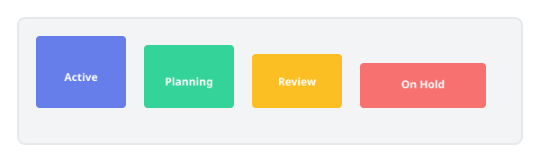
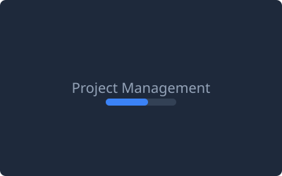
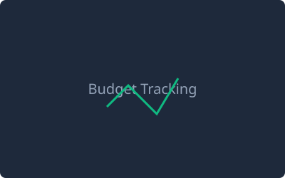
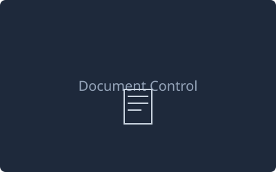
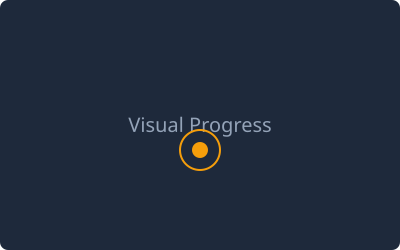
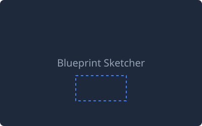
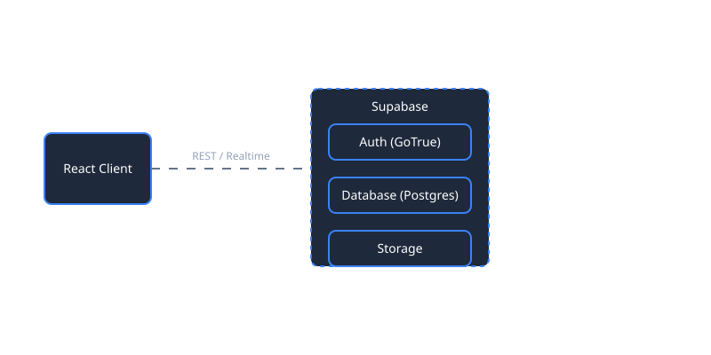

<!-- 
  ARCHITECT_AI README
  Theme: Neon Blue & Slate
  Style: Premium, Animated, Interactive
-->

<div align="center">

  <!-- Animated Banner -->
  

  <!-- Typing Animation -->
  <h1>
    <a href="https://github.com/jgoud00/ArchAi">
      
    </a>
  </h1>

  <!-- Motion Badges -->
  <p>
    
    
    
  </p>

  <p align="center">
    <b>A unified, enterprise-grade platform built for the future of construction.</b><br/>
    <i>Centralize data, streamline workflows, visualize progress, and enhance on-site productivity.</i>
  </p>

</div>

<br/>


<br/>

## 📋 Table of Contents

<details>
<summary><b>Expand</b></summary>

- [Overview](#-overview)
- [Key Features](#-key-features)
- [Tech Stack](#-tech-stack)
- [Architecture](#-architecture)
- [Getting Started](#-getting-started)
- [Environment Variables](#-environment-variables)
- [Running Locally](#-running-locally)
- [Deployment](#-deployment)
- [Project Structure](#-project-structure)
- [Database Schema](#-database-schema)
- [Contributing](#-contributing)
- [License](#-license)

</details>

<br/>

## 🎯 Overview

**ArchitectAI** modernizes construction management by replacing fragmented spreadsheets, offline files, and outdated tools with a unified digital workspace. Whether managing a single home build or multiple industrial projects, ArchitectAI provides visibility, automation, and collaboration features that scale with your team.

<br/>

<div align="center">
  
</div>

<br/>


<br/>

## ✨ Key Features

<div align="center">
  
</div>

<br/>

<div align="center">

| Feature | Description | Preview |
|--------|-------------|---------|
| **📊 Project Management** | Track project milestones, status, and team assignments. |  |
| **💰 Budget Tracking** | Monitor spending, consumption, and variance in real-time. |  |
| **📑 Document Control** | Store, version, and retrieve blueprints, contracts, and permits. |  |
| **📸 Visual Progress** | Organize drone scans and site images to document construction phases. |  |
| **✏️ Blueprint Sketcher** | Sketch, annotate, and markup blueprints directly in the app. |  |

</div>

<br/>

## 🛠️ Tech Stack

<div align="center">
  
</div>

<br/>


<br/>

## 🏗️ Architecture

ArchitectAI is structured on a modern **client–server architecture** powered by Supabase.

<div align="center">
  
</div>

<br/>

## 🚀 Getting Started

### Prerequisites
- Node.js v18+
- npm / yarn
- Git
- Supabase account

### Installation

<details>
<summary><b>Show Setup Instructions</b></summary>

1. Clone the repository  
```bash
git clone https://github.com/your-username/architect-ai.git
cd architect-ai
```

2. Install dependencies
```bash
npm install
```

3. Create your environment config
```bash
cp .env.example .env
```

</details> 

<br/>

## 🔐 Environment Variables

Configure your `.env` file:

```bash
VITE_SUPABASE_URL=your_project_url
VITE_SUPABASE_ANON_KEY=your_anon_key
```

> Values available under **Supabase → Settings → API**.

<br/>

## 🏃 Running Locally

### Start development server
```bash
npm run dev
```
Access at `http://localhost:5173`.

### Build for production
```bash
npm run build
```

### Preview build
```bash
npm run preview
```

<br/>

## 📦 Deployment

ArchitectAI is deploy-ready for:
- **Vercel**
- **Netlify**
- **AWS Amplify**
- **Render**

Ensure environment variables are added in the host’s dashboard.

<br/>

## 📂 Project Structure

```bash
src/
├── components/       # Reusable UI components
├── pages/            # Screens and routes
├── services/         # Supabase interaction layer
├── store/            # Zustand global state
├── hooks/            # Custom hooks
├── types/            # TypeScript types & interfaces
├── utils/            # Helper utilities
└── App.tsx           # App entry point
```

<br/>

## 🤝 Contributing

We welcome contributions!

1. **Fork** the repository
2. Create a **New Branch** (`git checkout -b feature/NewFeature`)
3. **Commit** your updates (`git commit -m 'Add some NewFeature'`)
4. **Push** the branch (`git push origin feature/NewFeature`)
5. Open a **Pull Request**

<br/>

## 📄 License

Licensed under the **MIT License**. See the [LICENSE](LICENSE) file.

<br/> 

<div align="center"> 
   
  <br/> 
  <b>ArchitectAI</b> — Building the future of construction. 
</div>
