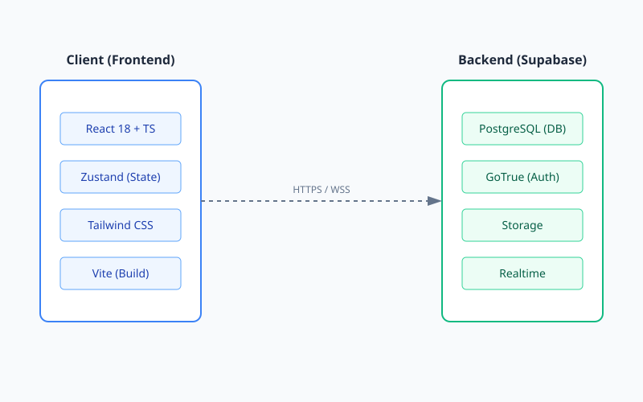
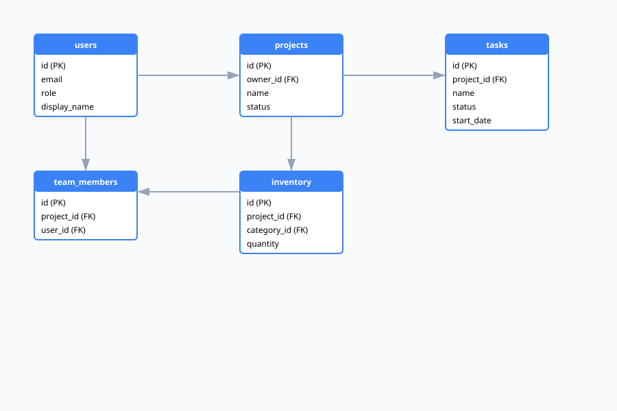

# ArchitectAI — Construction Management Platform


ArchitectAI is a comprehensive, enterprise-grade construction management platform designed to streamline workflows for architects, engineers, and supervisors. It unifies project tracking, budget management, document control, and team collaboration into a single, intuitive interface.

## Table of Contents

- [Overview](#overview)
- [Key Features](#key-features)
- [Tech Stack](#tech-stack)
- [Architecture](#architecture)
- [Getting Started](#getting-started)
- [Environment Variables](#environment-variables)
- [Running Locally](#running-locally)
- [Deployment](#deployment)
- [Project Structure](#project-structure)
- [Database Schema](#database-schema)
- [Contributing](#contributing)
- [License](#license)

## Overview

ArchitectAI modernizes construction management by replacing fragmented spreadsheets, offline files, and outdated tools with a unified digital workspace. Whether managing a single home build or multiple industrial projects, ArchitectAI provides visibility, automation, and collaboration features that scale with your team.

### Why ArchitectAI?

- **Centralized Information Hub**: Blueprints, budgets, photos, and timelines all live in one place.
- **Real-Time Collaboration**: Field and office teams stay perfectly in sync.
- **Visual Documentation**: Drone scans, site photos, and annotated reports.
- **Role-Based Security**: Admins, supervisors, and workers have appropriate access at all times.

## Key Features

| Feature | Description |
|---------|-------------|
| **Project Management** | Track project milestones, status, and team assignments. |
| **Budget Tracking** | Monitor spending, consumption, and variance in real-time. |
| **Document Control** | Store, version, and retrieve blueprints, contracts, and permits. |
| **Visual Progress** | Organize drone scans and site images to document construction phases. |
| **Layout Planner** | Sketch, annotate, and markup blueprints with real-world dimensions. |
| **Interactive Timeline** | Drag-and-drop Gantt chart for task scheduling. |
| **3D Model Viewer** | View and interact with 3D project models (.glb/.gltf). |

## Tech Stack

### Frontend

- **Framework**: React 18 + TypeScript
- **Styling**: Tailwind CSS + shadcn/ui
- **State Management**: Zustand
- **Visualization**: Recharts & Custom SVG Gantt
- **Testing**: Vitest + React Testing Library

### Backend

- **Core**: Supabase (PostgreSQL)
- **Auth**: Supabase Auth (RLS enabled)
- **Storage**: Supabase Storage (media, documents)

## Architecture

ArchitectAI is structured on a modern client–server architecture powered by Supabase.



- **Frontend**: React application handling UI, state, and business logic.
- **Backend**: Supabase providing Auth, Database (PostgreSQL), and Storage services.
- **Security**: Row Level Security (RLS) ensures data privacy and access control.

## Getting Started

### Prerequisites

- Node.js v18+
- npm or yarn
- Git
- Supabase account

### Installation

1. Clone the repository:
   ```bash
   git clone https://github.com/your-username/architect-ai.git
   cd architect-ai
   ```

2. Install dependencies:
   ```bash
   npm install
   ```

3. Create your environment configuration:
   ```bash
   cp .env.example .env
   ```

## Environment Variables

Configure your `.env` file with the following keys. Values are available under **Supabase → Settings → API**.

```bash
VITE_SUPABASE_URL=your_project_url
VITE_SUPABASE_ANON_KEY=your_anon_key
```

## Running Locally

### Start Development Server

```bash
npm run dev
```

Access the application at `http://localhost:5173`.

### Run Tests

```bash
npm test
```

### Build for Production

```bash
npm run build
```

## Deployment

ArchitectAI is ready for deployment on platforms such as:

- Vercel
- Netlify
- AWS Amplify
- Render

Ensure environment variables are added in the host’s dashboard.

## Project Structure

```text
src/
├── components/       # Reusable UI components
├── pages/            # Screens and routes
├── services/         # Supabase interaction layer
├── store/            # Zustand global state
├── hooks/            # Custom hooks
├── types/            # TypeScript types & interfaces
├── utils/            # Helper utilities
└── App.tsx           # App entry point
docs/
├── architecture/     # System diagrams
├── database/         # ER diagrams
├── api/              # API documentation
└── guides/           # Developer guides
```

## Database Schema

Key tables in the PostgreSQL database:



- **users**: User profiles and role definitions.
- **projects**: Core project details and status.
- **team_members**: Project assignments and permissions.
- **scans**, **documents**, **photos**: Media and file metadata.
- **issues**, **tasks**, **budgets**: Project management data.
- **inventory**, **inventory_categories**: Material tracking.
- **project_templates**: Reusable project structures.

## Contributing

We welcome contributions! Please read our [Contributing Guidelines](CONTRIBUTING.md) for details on our code of conduct, and the process for submitting pull requests.

## License

Licensed under the MIT License. See the [LICENSE](LICENSE) file for details.
