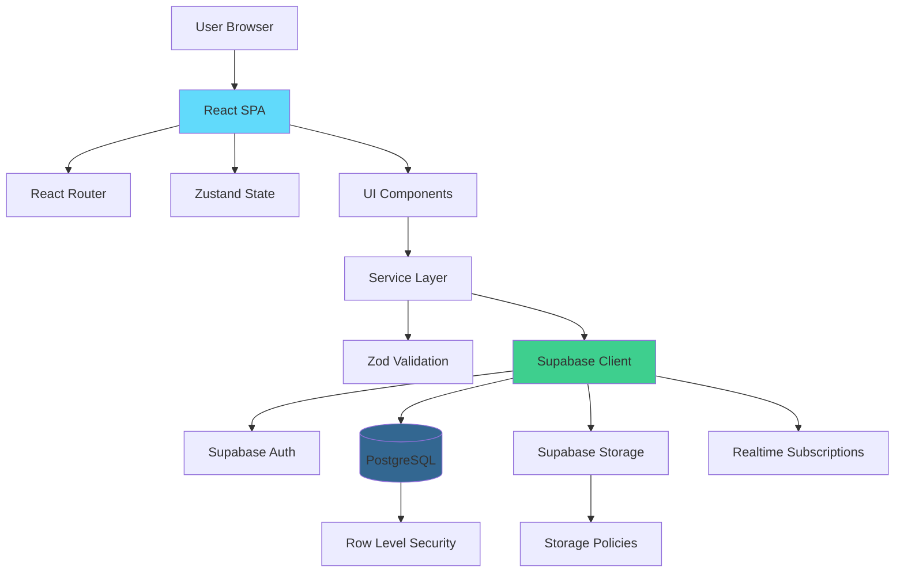
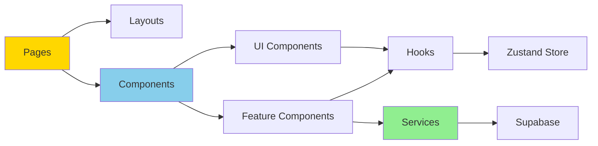
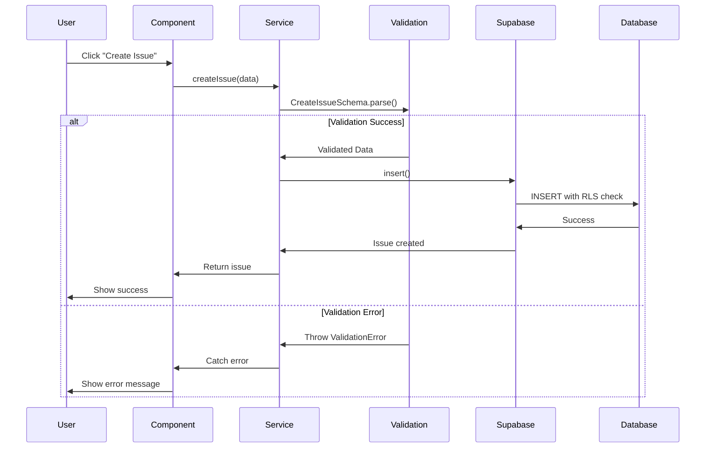
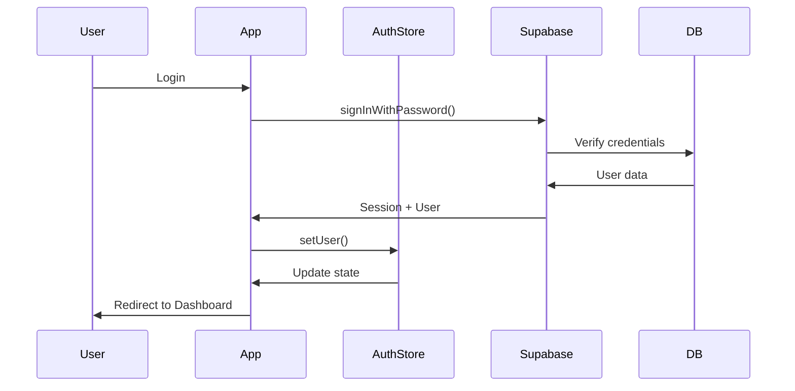
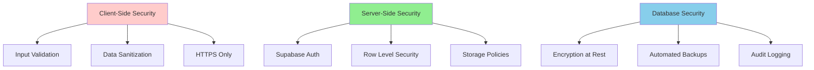
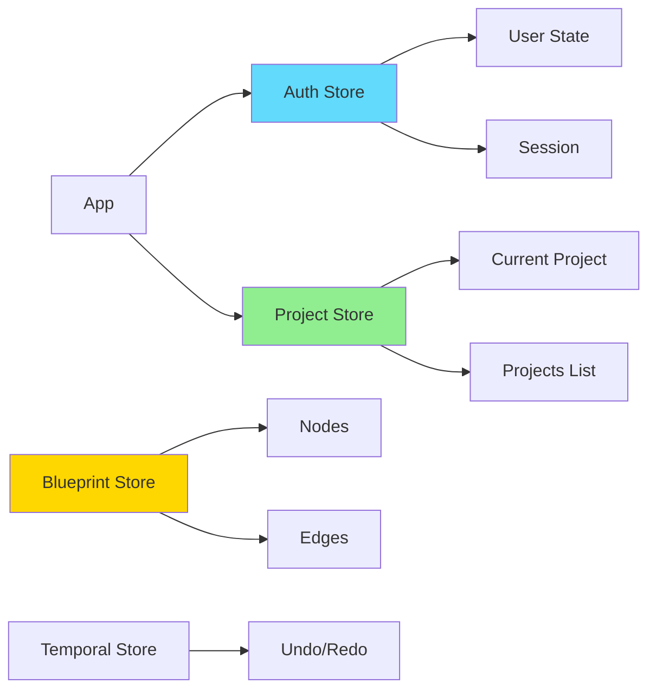

# ArchAi Architecture Overview

**Version**: 1.0  
**Last Updated**: December 10, 2025  
**Status**: Production-Ready

---

## Table of Contents

1. [System Architecture](#system-architecture)
2. [Technology Stack](#technology-stack)
3. [Application Layers](#application-layers)
4. [Data Flow](#data-flow)
5. [Security Architecture](#security-architecture)
6. [State Management](#state-management)
7. [Deployment Architecture](#deployment-architecture)

---

## 1. System Architecture

### High-Level Overview



### Component Architecture



---

## 2. Technology Stack

### Frontend

| Technology | Version | Purpose |
|------------|---------|---------|
| **React** | 18.x | UI framework |
| **TypeScript** | 5.x | Type safety |
| **Vite** | 7.x | Build tool |
| **React Router** | 6.x | Client-side routing |
| **Zustand** | 4.x | State management |
| **Zundo** | 2.x | Undo/redo functionality |
| **TailwindCSS** | 3.x | Styling |
| **Lucide React** | Latest | Icons |

### 3D & Visualization

| Technology | Purpose |
|------------|---------|
| **Three.js** | 3D rendering |
| **React Three Fiber** | React wrapper for Three.js |
| **@react-three/drei** | Three.js utilities |
| **XYFlow** | Blueprint/graph editor |
| **FullCalendar** | Calendar/scheduling |

### Backend & Database

| Technology | Purpose |
|------------|---------|
| **Supabase** | Backend platform |
| **PostgreSQL** | Database |
| **Row Level Security** | Database security |
| **Supabase Auth** | Authentication |
| **Supabase Storage** | File storage |
| **Supabase Realtime** | Live updates |

### Validation & Quality

| Technology | Purpose |
|------------|---------|
| **Zod** | Runtime validation |
| **ESLint** | Linting |
| **Vitest** | Unit testing |
| **Testing Library** | Component testing |

---

## 3. Application Layers

### Presentation Layer

**Location**: `src/pages`, `src/components`

- **Pages**: Top-level route components
- **Layouts**: Structural components (MainLayout, AuthLayout)
- **Components**: Reusable UI and feature components
- **UI Components**: Atomic design system components

**Responsibilities**:
- Render UI
- Handle user interactions
- Display data from stores
- Trigger service layer operations

### Business Logic Layer

**Location**: `src/services`

- **Service Classes**: Encapsulate business logic
- **BaseService**: Abstract class for common operations
- **Type Definitions**: TypeScript interfaces

**Responsibilities**:
- CRUD operations
- Business rule enforcement
- Data transformation
- Error handling
- Logging

**Example**:
```typescript
class IssueService extends BaseService<Issue> {
  protected tableName = 'issues'
  
  async createIssue(data: CreateIssueInput): Promise<Issue> {
    // Validate
    const validated = CreateIssueSchema.parse(data)
    
    // Create
    return this.create(validated)
  }
}
```

### Data Access Layer

**Location**: `src/services/supabase.ts`, Database

- **Supabase Client**: Configured client instance
- **PostgreSQL**: Database with RLS
- **Storage**: File upload/download

**Responsibilities**:
- Database queries
- File operations
- Real-time subscriptions
- Authentication

### Validation Layer

**Location**: `src/schemas`

- **Zod Schemas**: Input validation
- **Type Inference**: Automatic TypeScript types

**Responsibilities**:
- Input validation
- Type safety
- Error messages

---

## 4. Data Flow

### User Action Flow



### Authentication Flow



---

## 5. Security Architecture

### Defense in Depth



### Row Level Security (RLS)

**All tables protected with RLS policies**:

| Table | Policies | Access Control |
|-------|----------|----------------|
| projects | 4 | Owner + team members |
| issues | 4 | Project members |
| issue_comments | 4 | Comment owner + project owner |
| tasks | 4 | Project members |
| budgets | 4 | Project owner |
| expenses | 4 | Budget owner |
| inventory | 4 | Project editors |
| scans | 4 | Project editors |
| blueprints | 4 | Project editors |

**Policy Pattern**:
```sql
-- SELECT: View if project member
CREATE POLICY "users_select_issues"
ON issues FOR SELECT
USING (
  EXISTS (
    SELECT 1 FROM projects p
    LEFT JOIN team_members tm ON tm.project_id = p.id
    WHERE p.id = issues.project_id
      AND (p.owner_id = auth.uid() OR tm.user_id = auth.uid())
  )
);
```

### Authentication

- **Method**: Email + Password (Supabase Auth)
- **Session Management**: JWT tokens
- **Password Requirements**: Min 8 chars, mixed case, numbers
- **Protected Routes**: All dashboard routes require authentication

---

## 6. State Management

### Zustand Stores



### Store Architecture

**Auth Store** (`authStore.ts`):
```typescript
interface AuthState {
  user: User | null
  loading: boolean
  initializeAuth: () => Promise<void>
  logout: () => Promise<void>
}
```

**Undo/Redo** (`temporalStore.ts`):
- Uses Zundo for time-travel debugging
- Applied to blueprint editor
- 50-state history limit

---

## 7. Deployment Architecture

### Production Stack

```mermaid
graph TB
    Users[Users] --> CDN[Vercel CDN]
    CDN --> App[React SPA]
    
    App --> Supabase[Supabase Platform]
    Supabase --> PostgreSQL[(PostgreSQL)]
    Supabase --> Storage[Object Storage]
    
    CI[GitHub Actions] --> Build[Build & Test]
    Build --> Deploy[Deploy to Vercel]
    
    style CDN fill:#000
    style Supabase fill:#3ecf8e
    style PostgreSQL fill:#336791
```



### Hosting

- **Frontend**: Vercel (or similar)
- **Backend**: Supabase (managed)
- **Database**: Supabase PostgreSQL
- **Storage**: Supabase Storage
- **CDN**: Vercel Edge Network

### Environment Variables

```bash
# Required
VITE_SUPABASE_URL=https://xxx.supabase.co
VITE_SUPABASE_ANON_KEY=your-anon-key

# Optional
VITE_SENTRY_DSN=your-sentry-dsn
```

---

## Performance Considerations

### Frontend Optimizations

- ✅ Lazy loading for routes
- ✅ Code splitting (Vite)
- ✅ React.memo for expensive components
- ✅ Virtual scrolling for long lists
- ✅ Image optimization
- ✅ Bundle size monitoring

### Database Optimizations

- ✅ Indexes on all foreign keys
- ✅ Composite indexes for common queries
- ✅ Partial indexes (e.g., low inventory)
- ✅ Connection pooling (Supabase)

### Caching Strategy

- **Static Assets**: CDN caching (1 year)
- **API Responses**: Supabase client caching
- **User Sessions**: LocalStorage
- **3D Models**: Browser cache

---

## Monitoring & Observability

### Logging

- **Client**: Structured logging via `logger.ts`
- **Levels**: error, warn, info, debug
- **Context**: User ID, project ID, timestamps
- **Integration**: Ready for Sentry

### Metrics

- **Build Time**: ~30s
- **Bundle Size**: ~2.5MB (gzipped: ~600KB)
- **Lighthouse Score**: Target 90+
- **Core Web Vitals**: Monitored

---

## Security Best Practices

1. ✅ **Input Validation**: Zod schemas
2. ✅ **Output Sanitization**: DOMPurify for user content
3. ✅ **SQL Injection**: Parameterized queries (Supabase)
4. ✅ **XSS Prevention**: React escaping + DOMPurify
5. ✅ **CSRF Protection**: Supabase tokens
6. ✅ **RLS**: All sensitive tables
7. ✅ **HTTPS Only**: Enforced
8. ✅ **Secure Headers**: CSP, X-Frame-Options

---

## Future Architecture Considerations

### Scalability

- **Horizontal**: Supabase auto-scales
- **Vertical**: Database connection pooling
- **Caching**: Redis for session store (future)
- **LOAD**: CDN handles static assets

### Extensibility

- **Plugin System**: Could add third-party integrations
- **API Layer**: Could expose REST/GraphQL
- **Webhooks**: Could add event notifications
- **Multi-tenancy**: Architecture supports

---

## Conclusion

ArchAi follows a **modern, scalable, and secure architecture** with:
- Clean separation of concerns
- Type-safe operations
- Comprehensive security
- Performance optimizations
- Production-ready infrastructure

**Status**: ✅ **PRODUCTION-READY**
